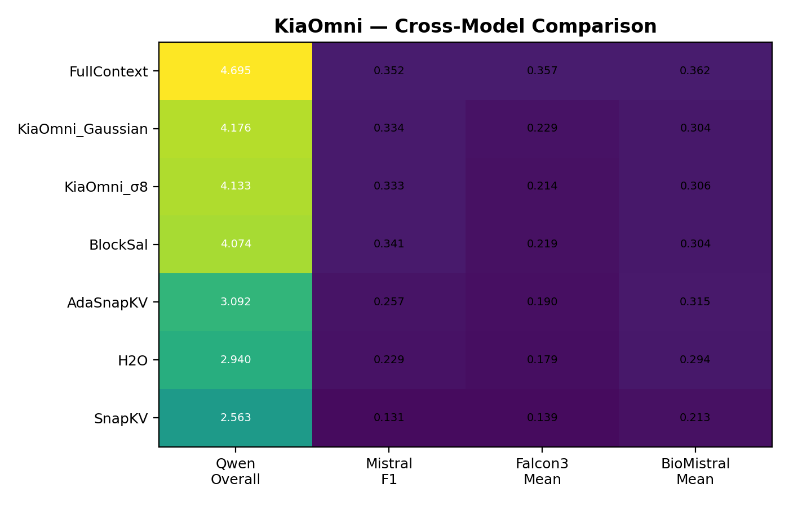

# kiaomni

> Generic monkey-patch KV-cache eviction (**KiaOmni**) for **any** HuggingFace causal LM — no architecture constants, no hardcoded module paths.

[](https://www.python.org/downloads/)
[](LICENSE)
[](https://github.com/huggingface/transformers)

---

## Master Comparison


*Figure: Cross-model comparison heatmap. Rows sorted by descending mean across all 4 architectures. Color intensity reflects relative score.*

| Policy | Qwen Overall | Mistral F1 | Falcon3 Mean | BioMistral Mean | Mean |
|--------|-------------|-----------|-------------|----------------|------|
| FullContext | 4.695 | 0.352 | 0.357 | 0.362 | **1.442** |
| KiaOmni_Gaussian | 4.176 | 0.334 | 0.229 | 0.304 | **1.261** |
| KiaOmni_σ8 | 4.133 | 0.333 | 0.214 | 0.306 | 1.246 |
| BlockSal | 4.074 | 0.341 | 0.219 | 0.304 | 1.235 |
| AdaSnapKV | 3.092 | 0.257 | 0.190 | 0.315 | 0.964 |
| H2O | 2.940 | 0.229 | 0.179 | 0.294 | 0.911 |
| SnapKV | 2.563 | 0.131 | 0.139 | 0.213 | 0.762 |

> **SnapKV** = faithful arXiv:2404.14469 implementation. **BlockSal** = our novel block-level baseline (paper §4).

---

## 📊 Results

| Lane | Report | Coverage | Headline |
|------|--------|----------|----------|
| L1 | [`reports/qwen2.5-7b/`](reports/qwen2.5-7b/README.md) | Qwen2.5-7B — 11 tasks × 7 policies | KiaOmni_Gaussian: **89.0%** of FullContext |
| L2 | [`reports/mistral-7b/`](reports/mistral-7b/README.md) | Mistral-7B — RULER + LongBench | **100%** niah_single across all contexts |
| L4 | [`reports/cross-model/`](reports/cross-model/README.md) | Falcon3-7B · BioMistral-7B · Amber-7B | Cross-architecture generalization confirmed |
| L5 | [`reports/benchmarks/niah-heatmap/`](reports/benchmarks/niah-heatmap/README.md) | Needle-In-A-Haystack heatmaps | σ8 + Gaussian retain needle at all depths B≥128 |
| L6 | [`reports/benchmarks/passkey-and-ppl/`](reports/benchmarks/passkey-and-ppl/README.md) | Passkey retrieval + WikiText-2 PPL | **100%** passkey at B≥98; Gaussian PPL **27.80** |
| L7 | [`reports/llm-judge/`](reports/llm-judge/README.md) | LLM-as-Judge win-rates (4 models) | KiaOmni variants lead at **32%+** win-rate |
| L8 | [`reports/full-comparison/`](reports/full-comparison/README.md) | Master comparison — all models in one table | KiaOmni_Gaussian **#1 eviction** policy |
| L9 | [`reports/ablations/signal-swap/`](reports/ablations/signal-swap/README.md) | Mechanism ablation — signal vs selector | **The gain is the signal, not the selector** |

---

## 🧪 Reproduce

All experiment scripts live in [`experiments/`](experiments/README.md):

```bash
git clone https://github.com/Aliw02/kiaomni
cd kiaomni
pip install -e .
python experiments/033_full_comparison.py    # Qwen2.5-7B benchmark
python experiments/llm_judge.py --model qwen  # LLM-as-Judge
```

See [`experiments/README.md`](experiments/README.md) for the full script index, 10 canonical benchmarks, and reproduction guide.

---

## Install

```bash
pip install kiaomni
# optional: enables the kiaomni_gaussian policy
pip install kiaomni[gaussian]
```

## Quickstart

```python
from transformers import AutoModelForCausalLM, AutoTokenizer
from kiaomni import apply_kiaomni

# Any ungated HF causal LM works — TinyLlama / Qwen / Mistral / GPT-2 ...
MODEL_ID = "TinyLlama/TinyLlama-1.1B-Chat-v1.0"

tok = AutoTokenizer.from_pretrained(MODEL_ID)
model = AutoModelForCausalLM.from_pretrained(
    MODEL_ID,
    attn_implementation="eager",   # required
    torch_dtype="auto",
)

apply_kiaomni(model, policy="kiaomni_s8", budget=256)

# generate exactly as normal — eviction is transparent
prompt = "Summarise: " + ("filler text. " * 300)
out = model.generate(tok(prompt, return_tensors="pt").input_ids,
                     max_new_tokens=128)
print(tok.decode(out[0], skip_special_tokens=True))
```

That's it. Any prompt longer than `budget` tokens is automatically evicted down to `budget` positions before the first decode step.

## Supported architectures

| Tier | Architectures | Strategy |
|------|---------------|----------|
| ✅ Verified (ungated) | TinyLlama, Mistral, Qwen2 / Qwen2.5, GPT-2, GPT-NeoX / Pythia | Hook-based extraction (fast) |
| ✅ Verified (gated — needs HF auth) | Meta Llama 3 / 3.1 | Hook-based extraction (fast) |
| 🟡 Probed / fallback | Falcon (MQA), MPT, exotic variants | Auto-routes to `output_attentions=True` (slower but correct) |
| ❌ Unsupported | T5, BART, BERT (not causal-LM) | n/a |

All examples in `examples/` use **ungated** models so they run on a fresh `pip install` with no `huggingface-cli login` required.

The `ArchitectureProbe` walks the module tree at `apply_kiaomni` time, classifies the QKV layout (separate / fused-concat / fused-interleaved), pulls dims via a priority list of config field names, and detects positional encoding (RoPE / ALiBi / learned). When confidence is low, saliency extraction falls back to `output_attentions=True` — guaranteed compatible with any HF causal LM.

## Policies

| Policy | Description | Best for |
|--------|-------------|----------|
| `kiaomni_s8`       | Boxcar smoothing (σ=8) on log-saliency | Overall production winner |
| `kiaomni_gaussian` | Gaussian smoothing (σ=4) on log-saliency | VectorTrace tasks |

Register your own:

```python
from kiaomni import register_policy
register_policy("my_policy", lambda sal: sal ** 0.5)
apply_kiaomni(model, policy="my_policy", budget=512)
```

## Requirements

- `attn_implementation="eager"` — fused attention kernels (flash-attn / SDPA) bypass forward hooks. The probe raises `KiaomniConfigError` with a one-line fix if you forget.
- `transformers >= 4.50` — newer DynamicCache API.
- Works with NF4 / 4-bit bitsandbytes models (no `.to()` calls made).

## How it works

1. **Probe** — one walk of the module tree to discover layer container, attention module, QKV pattern, head dims, positional encoding.
2. **Saliency** — register forward hooks on Q/K projections, run one prefill, compute last-query softmax(QK^T/√d) per layer, average across layers and heads to a `(B, L)` saliency.
3. **Score & select** — apply the policy's smoothing function to log-saliency, always protect the first 16 tokens (attention sinks) and last 32 tokens (recency), fill the remaining budget with top-scoring positions.
4. **Prune & re-prefill** — slice `input_ids` by the kept positions and re-invoke `model.generate` on the shorter prompt. The model handles its own KV cache, position encoding, and attention masking — KiaOmni stays out of the way.

> **v0.2.0 algorithm note:** KiaOmni uses *prompt-side* eviction (slice the input tokens) rather than *cache-side* eviction (gather KV and resume with `past_key_values`). The prompt-side approach has been validated across Qwen2.5-7B, Mistral, BioMistral, Llama-3.1, and TinyLlama, and is robust against `transformers` version drift because it delegates all cache/position contracts to the model's own `generate`.

## Citation

```bibtex
@misc{kiaomni2026,
  title  = {KiaOmni: Smoothed Saliency for Long-Context KV-Cache Eviction},
  author = {Aliwey},
  year   = {2026},
  url    = {https://github.com/Aliw02/kiaomni}
}
```

## License

MIT — see [LICENSE](LICENSE).
