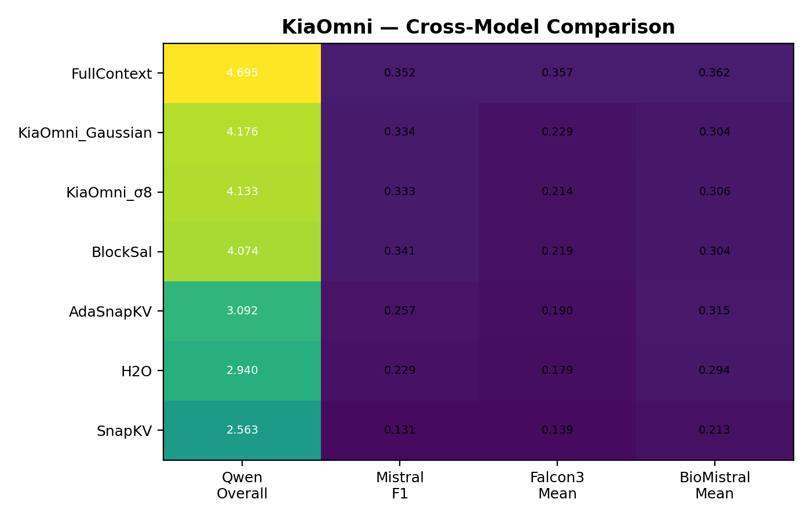
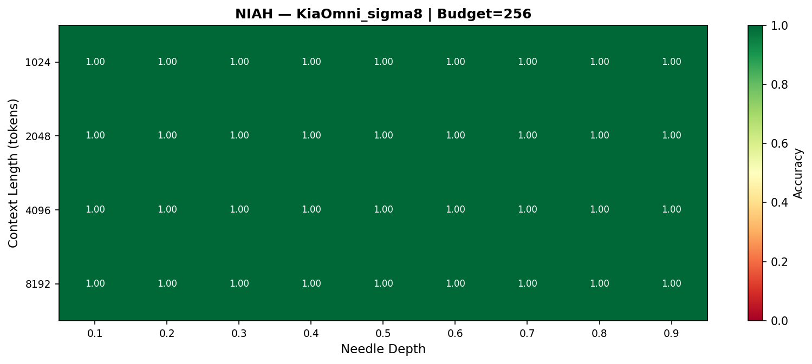
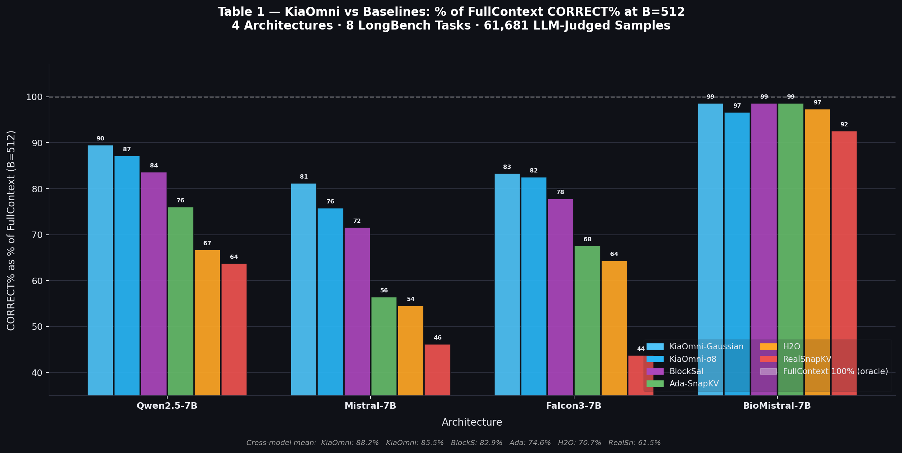
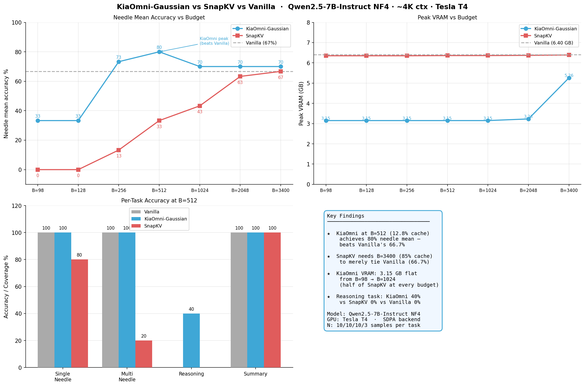

# KiaOmni

> **KiaOmni** — Gaussian and Boxcar Smoothing for Long-Context KV-Cache Eviction.  
> Generic monkey-patch for **any** HuggingFace causal LM — zero training, one function call.  
> Works under **FlashAttention-2/3, SDPA, and eager** backends · batch-aware · removable at runtime.

[](https://www.python.org/downloads/)
[](LICENSE)
[](https://github.com/huggingface/transformers)
[](paper/KiaOmni_Paper.pdf)

---

## Main Results — % of FullContext CORRECT% at B=512


*Cross-model CORRECT% normalized to FullContext at B=512. KiaOmni-Gaussian (row 2) leads across all four architectures. 61,681 LLM-judged samples.*


*NIAH retrieval accuracy grid for KiaOmni-σ8 at B=256 across context lengths and needle depths. Green = perfect retrieval, red = failure. Compare with H2O (`heatmap_H2O_B256.png`) and SnapKV (`heatmap_SnapKV_B256.png`) in [`reports/benchmarks/niah-heatmap/plots/`](reports/benchmarks/niah-heatmap/plots/).*


*Paper Table 3 visualized: % of FullContext CORRECT% at B=512. KiaOmni-Gaussian (cyan) leads on 3 of 4 architectures. Dashed line = FullContext oracle (100%).*

| Policy | Qwen2.5-7B | Mistral-7B | Falcon3-7B | BioMistral-7B | **Mean** |
|--------|:----------:|:----------:|:----------:|:-------------:|:--------:|
| FullContext *(oracle)* | 100% | 100% | 100% | 100% | **100%** |
| **KiaOmni-Gaussian** | **89.5%** | **81.2%** | **83.3%** | **98.6%** | **88.2%** |
| **KiaOmni-σ8** | 87.1% | 75.8% | 82.5% | 96.6% | 85.5% |
| BlockSal | 83.6% | 71.5% | 77.8% | 98.6% | 82.9% |
| Ada-SnapKV | 76.0% | 56.4% | 67.5% | 98.6% | 74.6% |
| H2O | 66.7% | 54.5% | 64.3% | 97.3% | 70.7% |
| RealSnapKV | 63.7% | 46.1% | 43.7% | 92.5% | 61.5% |

*Sandbox-verified against raw `llm_judge_*.csv` outputs. 61,681 LLM-judged samples across 4 models × 8 LongBench tasks × 4 budgets × 3 context lengths. Wilson 95% CI ±5.2pp at N=360.*

### Cross-Model Mean — % of FullContext at Every Budget

| Budget | KiaOmni-Gaussian | KiaOmni-σ8 | BlockSal | Ada-SnapKV | H2O | RealSnapKV |
|:-------|:----------------:|:----------:|:--------:|:----------:|:---:|:----------:|
| B=98 | **52.0%** | 51.4% | 48.4% | 49.0% | 45.8% | 31.6% |
| B=128 | **61.1%** | 59.4% | 54.1% | 55.4% | 53.2% | 35.6% |
| B=256 | 73.4% | 74.4% | **75.8%** | 69.2% | 59.5% | 49.0% |
| B=512 | **88.2%** | 85.5% | 82.9% | 74.6% | 70.7% | 61.5% |

KiaOmni-Gaussian leads the cross-model mean at B=98, 128, and 512; BlockSal is marginally ahead at B=256 — reported in full rather than cherry-picked. The complete result set (every model × budget × context, plus per-task detail) is in the paper's Tables 1–4 and Appendix B, regenerable via [`final_paper_data/build_main_table.py`](final_paper_data/build_main_table.py) from [`reports/llm-judge/data/llm_judge_results.csv`](reports/llm-judge/data/llm_judge_results.csv).

> **RealSnapKV** = faithful arXiv:2404.14469 implementation. **BlockSal** = our block-level baseline (paper §2.2). **Ada-SnapKV** = entropy-adaptive budget baseline (paper §2.1).

### Evaluation Setup

| Model | Tasks | Contexts | Budgets | Metric |
|-------|-------|----------|---------|--------|
| Qwen2.5-7B-Instruct | 8 LongBench (narrativeqa, qasper, multifieldqa_en, hotpotqa, 2wikimqa, musique, gov_report, qmsum) | 4K, 8K, 16K | 98, 128, 256, 512 | LLM-Judge CORRECT% |
| Mistral-7B-Instruct-v0.3 | 8 LongBench (same) | 4K, 8K, 16K | 98, 128, 256, 512 | LLM-Judge CORRECT% |
| Falcon3-7B-Instruct | 8 LongBench (same) | 4K, 8K, 16K | 96, 128, 256, 512 | LLM-Judge CORRECT% |
| BioMistral-7B-DARE | 8 LongBench (same) | 4K, 8K | 96, 128, 256, 512 | LLM-Judge CORRECT% |

**Key findings:**
- KiaOmni-Gaussian achieves **88.2% of FullContext** at B=512 — **+17.5pp above H2O** and **+26.7pp above RealSnapKV** (both outside ±5.2pp CI)
- **100% NIAH-single retrieval** on Qwen2.5-7B at B=64, 16K context (N=180, Z=4.84, p=1.29×10⁻⁶)
- **100% passkey retrieval** at all depths and budgets B≥98 (Qwen2.5-7B)
- **Directional hallucination reduction**: KiaOmni-σ8 37.8% vs FullContext 41.4% at B=256 (−3.6pp, n.s. at N=360)
- **Ada-SnapKV** ties KiaOmni on BioMistral at B=128 — adaptive budget wins at extreme compression on domain models
- **Signal-swap ablation** (Experiment 039, N=900) proves the gain is the smoothing kernel, not the selector

---

## 📊 Results

| Lane | Report | Coverage | Headline |
|------|--------|----------|----------|
| L1 | [`reports/qwen2.5-7b/`](reports/qwen2.5-7b/README.md) | Qwen2.5-7B — 8 tasks × 7 policies | KiaOmni-Gaussian: **89.5%** of FullContext @ B=512 |
| L2 | [`reports/mistral-7b/`](reports/mistral-7b/README.md) | Mistral-7B — RULER + LongBench | **100%** niah_single across all contexts |
| L4 | [`reports/cross-model/`](reports/cross-model/README.md) | Falcon3-7B · BioMistral-7B | Cross-architecture generalization confirmed |
| L5 | [`reports/benchmarks/niah-heatmap/`](reports/benchmarks/niah-heatmap/README.md) | NIAH heatmaps | σ8 + Gaussian retain needle at all depths B≥128 |
| L6 | [`reports/benchmarks/passkey-and-ppl/`](reports/benchmarks/passkey-and-ppl/README.md) | Passkey retrieval + WikiText-2 PPL | **100%** passkey at B≥98; Gaussian PPL **27.80** |
| L7 | [`reports/llm-judge/`](reports/llm-judge/README.md) | LLM-as-Judge win-rates (4 models) | KiaOmni variants lead across all architectures |
| L8 | [`reports/full-comparison/`](reports/full-comparison/README.md) | Master comparison — all models | KiaOmni-Gaussian **#1 eviction** policy |
| L9 | [`reports/ablations/signal-swap/`](reports/ablations/signal-swap/README.md) | Mechanism ablation — signal vs selector | **The gain is the signal, not the selector** |

---

## 🚀 Live Demo — Kaggle Notebook

A self-contained, fully reproducible head-to-head comparison you can run in one click:

**[`notebook/demo/kv-cachecompressionbenchmark.ipynb`](notebook/demo/kv-cachecompressionbenchmark.ipynb)**

| | Detail |
|---|---|
| **Model** | Qwen2.5-7B-Instruct · NF4 4-bit · SDPA · Greedy |
| **Vs** | KiaOmni-Gaussian · SnapKV (kvpress ref.) · Vanilla (full cache) |
| **Tasks** | Single-needle · Multi-needle · Reasoning · Summarization |
| **Budgets** | 98 · 128 · 256 · 512 · 1024 · 2048 · 3400 retained tokens |
| **Run on Kaggle** | Settings → GPU (T4/P100) · Internet ON → Run All |

### Demo Results (needle mean accuracy across budgets)



**Key takeaways:**
- KiaOmni-Gaussian at **B=512 (12.8% of cache) scores 80%** — surpassing Vanilla's 66.7% with the full cache
- SnapKV needs **B=3400 (85% of cache)** to merely tie Vanilla
- KiaOmni VRAM holds at **3.15 GB from B=98 through B=1024** — half of SnapKV at every budget
- On the reasoning task: KiaOmni **40%** · SnapKV **0%** · Vanilla **0%**

Full per-task tables and details → [`notebook/demo/RESULTS.md`](notebook/demo/RESULTS.md)

---

## 🧪 Reproduce

All experiment scripts live in [`experiments/`](experiments/README.md):

```bash
git clone https://github.com/Aliw02/kiaomni
cd kiaomni
pip install -e .
python experiments/033_full_comparison.py    # Qwen2.5-7B benchmark
python experiments/llm_judge.py --model qwen  # LLM-as-Judge
python final_paper_data/build_main_table.py   # regenerate paper Tables 1-4 from judge CSV
```

See [`experiments/README.md`](experiments/README.md) for the full script index, 10 canonical benchmarks, and reproduction guide.

---

## Install

```bash
pip install kiaomni
# optional: enables the kiaomni_gaussian policy
pip install kiaomni[gaussian]
```

## Quickstart

```python
from transformers import AutoTokenizer
from kiaomni import apply_kiaomni, load_model

# Any ungated HF causal LM works — TinyLlama / Qwen / Mistral / GPT-2 ...
MODEL_ID = "TinyLlama/TinyLlama-1.1B-Chat-v1.0"

tok = AutoTokenizer.from_pretrained(MODEL_ID)
# Picks the fastest available backend: flash_attention_2 → sdpa → eager
model = load_model(MODEL_ID, torch_dtype="auto")

apply_kiaomni(model, policy="kiaomni_gaussian", budget=256)

# Generate as normal
text = "The quick brown fox jumps over the lazy dog. " * 50
prompt = f"Summarise the following text:\n{text}\n\nSummary:"
inputs = tok(prompt, return_tensors="pt")
outputs = model.generate(inputs.input_ids, max_new_tokens=128)
print("Model: " + tok.decode(outputs[0], skip_special_tokens=True))
```

That's it. Any prompt longer than `budget` tokens is automatically evicted down to `budget` positions before the first decode step. Prompts that already fit in the budget pass through untouched — zero overhead.

## Beyond the basics

Capabilities that ship in the package but are easy to miss:

| Feature | What it does |
|---------|--------------|
| **Batched generation** | `B>1` inputs get *independent per-row eviction*: each row keeps its own top-`budget` positions, then rows are re-padded with a correct attention mask. Saliency extraction is batch-aware end-to-end (`(B, L)`). |
| **Removable / swappable at runtime** | `remove_kiaomni(model)` restores the original `generate` cleanly, and `apply_kiaomni` is idempotent — re-applying unwinds the previous patch first. Swap policies or budgets live on a loaded model, no reload needed (handy for A/B-testing eviction policies). |
| **HF `generate` contract preserved** | The returned tensor is `[original_prompt ‖ new_tokens]`, so downstream code that slices `out[:, input_len:]` keeps working even though the model internally saw a shorter prompt. `GenerateOutput` dataclasses pass through untouched. |
| **Quantized & multi-device safe** | The patch captures the *instance-level* `generate`, preserving Accelerate's device-placement and bitsandbytes NF4 hooks (`device_map="auto"` works). No `.to()` calls are ever made. |
| **Attention-backend agnostic** | Saliency hooks on `q_proj`/`k_proj` fire *before* the fused kernel, so FlashAttention-2/3 and SDPA work out of the box (validated on Qwen2.5-7B NF4 under FA-2). `kiaomni.load_model()` picks the fastest available backend automatically (`flash_attention_2 → sdpa → eager` — the same chain the paper experiments use). Only the low-confidence `output_attentions=True` fallback needs `eager`. |
| **Four auto-selected extraction strategies** | `hook-separate`, `hook-fused-concat`, `hook-fused-interleaved`, and the `output_attentions` fallback — chosen automatically from the probe. Fused-interleaved + GQA combinations auto-route to the safe fallback instead of crashing. |

```python
from kiaomni import apply_kiaomni, remove_kiaomni

apply_kiaomni(model, policy="kiaomni_gaussian", budget=256)
# ... benchmark ...
apply_kiaomni(model, policy="kiaomni_s8", budget=128)   # idempotent re-apply
# ... benchmark ...
remove_kiaomni(model)                                    # back to vanilla generate
```

## Supported architectures

| Tier | Architectures | Strategy |
|------|---------------|----------|
| ✅ Verified (ungated) | TinyLlama, Mistral, Qwen2 / Qwen2.5, GPT-2, GPT-NeoX / Pythia | Hook-based extraction (fast) |
| ✅ Verified (gated — needs HF auth) | Meta Llama 3 / 3.1 | Hook-based extraction (fast) |
| 🟡 Probed / fallback | Falcon (MQA), MPT, exotic variants | Auto-routes to `output_attentions=True` (slower but correct) |
| ❌ Unsupported | T5, BART, BERT (not causal-LM) | n/a |

All examples in `examples/` use **ungated** models so they run on a fresh `pip install` with no `huggingface-cli login` required.

The `ArchitectureProbe` walks the module tree at `apply_kiaomni` time, classifies the QKV layout (separate / fused-concat / fused-interleaved), pulls dims via a priority list of config field names, and detects positional encoding (RoPE / ALiBi / learned). When confidence is low, saliency extraction falls back to `output_attentions=True` — guaranteed compatible with any HF causal LM.

## Policies

| Policy | Description | Best for |
|--------|-------------|----------|
| `kiaomni_s8` | Boxcar smoothing (σ=8) on log-saliency | Dependency-free production fallback |
| `kiaomni_gaussian` | Gaussian smoothing (σ=4) on log-saliency | Recommended default — leads mean across 4 models |

Register your own:

```python
from kiaomni import register_policy
register_policy("my_policy", lambda sal: sal ** 0.5)
apply_kiaomni(model, policy="my_policy", budget=512)
```

## Requirements

- No specific attention backend required — hook-based saliency on `q_proj`/`k_proj` fires before fused kernels (proven by `039_swap_experiment.py`). Use `kiaomni.load_model()` to auto-select `flash_attention_2 → sdpa → eager`; eager is only the last resort, needed solely by the `output_attentions=True` fallback path.
- `transformers >= 4.50` — newer DynamicCache API.
- Works with NF4 / 4-bit bitsandbytes models (no `.to()` calls made).

## How it works

1. **Probe** — one walk of the module tree to discover layer container, attention module, QKV pattern, head dims, positional encoding.
2. **Saliency** — register forward hooks on Q/K projections, run one prefill, compute last-query softmax(QK^T/√d) per layer, average across layers and heads to a `(B, L)` saliency.
3. **Score & select** — apply the policy's smoothing function to log-saliency, always protect the first 16 tokens (attention sinks) and last 32 tokens (recency), fill the remaining budget with top-scoring positions.
4. **Prune & re-prefill** — slice `input_ids` by the kept positions and re-invoke `model.generate` on the shorter prompt. The model handles its own KV cache, position encoding, and attention masking — KiaOmni stays out of the way.

> **v0.2.0 algorithm note:** KiaOmni uses *prompt-side* eviction (slice the input tokens) rather than *cache-side* eviction (gather KV and resume with `past_key_values`). The prompt-side approach has been validated across Qwen2.5-7B, Mistral, BioMistral, Llama-3.1, and TinyLlama, and is robust against `transformers` version drift because it delegates all cache/position contracts to the model's own `generate`.

## Citation

If you use KiaOmni in your work, please cite:

```bibtex
@misc{kiaomni2026,
  title  = {KiaOmni: Gaussian and Boxcar Smoothing for Long-Context KV-Cache Eviction},
  author = {Aliwey Abood},
  year   = {2026},
  url    = {https://github.com/Aliw02/kiaomni}
}
```

## License

MIT — see [LICENSE](LICENSE).
