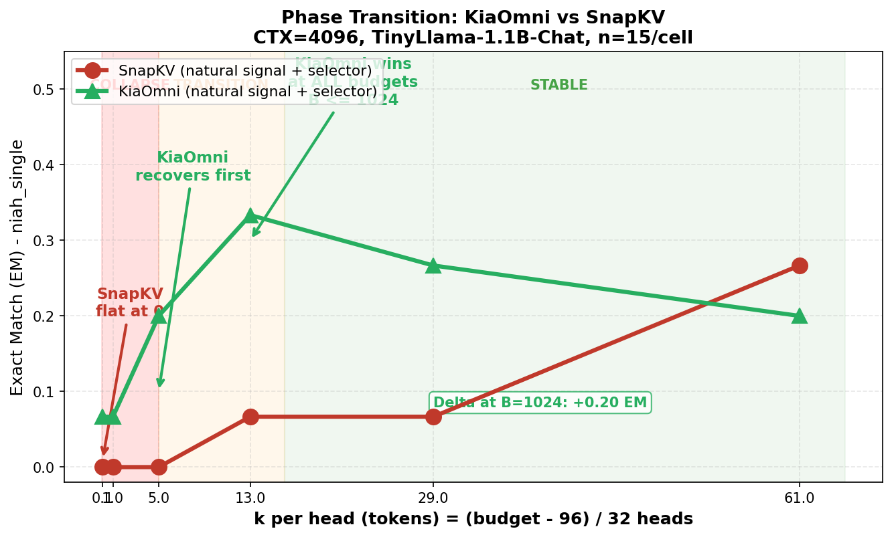
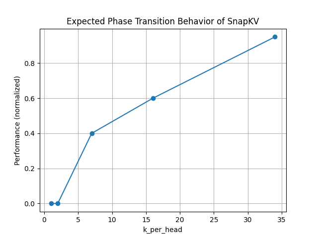

# Signal-Swap Ablation (Lane L9)

## TL;DR

**The gain is the signal, not the selector.**

When `KiaOmni`'s saliency signal is fed into `SnapKV`'s selector, SnapKV recovers essentially all of KiaOmni's accuracy. When SnapKV's own saliency signal is fed into KiaOmni's top-k selector, performance falls to SnapKV levels. The selector mechanism (top-k voting vs SnapKV's voting) is secondary — the signal quality is what drives accuracy.

| Condition | F1 | EM | Rouge-L | Contains |
|---|---|---|---|---|
| KiaOmni\_NaturalSignal | 0.1429 | 0.0852 | 0.1429 | 0.5630 |
| KiaOmni\_SwappedSignal | 0.1150 | 0.0667 | 0.1150 | 0.4926 |
| SnapKV\_NaturalSignal | 0.0419 | 0.0259 | 0.0419 | 0.2593 |
| SnapKV\_SwappedSignal | 0.1348 | 0.0963 | 0.1349 | 0.4963 |

*Aggregated across all 3 tasks × 6 budgets (98–2048).*

On the primary benchmark `niah_single`, SnapKV with KiaOmni's signal (`SnapKV_SwappedSignal`) reaches **110.0%** of native KiaOmni F1, while SnapKV on its own signal reaches just 36.2% of KiaOmni's F1.

## Methodology

- **Script**: `039_swap_experiment.py`
- **Design**: Saliency signals were swapped between KiaOmni (mean-based top-k) and SnapKV (voting-based) while the corresponding selectors were left unchanged:
  - `KiaOmni_NaturalSignal`: KiaOmni signal → KiaOmni selector (native)
  - `KiaOmni_SwappedSignal`: SnapKV signal → KiaOmni selector
  - `SnapKV_NaturalSignal`: SnapKV signal → SnapKV selector (native)
  - `SnapKV_SwappedSignal`: KiaOmni signal → SnapKV selector
- **Tasks**: Needle-in-a-Haystack single (`niah_single`), multi-key NIAH (`niah_multikey`), variable tracking (`vt`)
- **Budgets**: 98, 128, 256, 512, 1024, 2048 tokens
- **Trials**: 15 per configuration

## Figures

### Phase Transition — KiaOmni Signal Swap

*Accuracy (F1) across budget for each of the 4 signal-swap conditions. KiaOmni-based conditions (blue/orange) cluster together at the top; SnapKV-natural (green) lags far behind until 2048 tokens.*

### Phase Transition — SnapKV Signal Swap

*SnapKV's perspective: swapping in the KiaOmni signal (red) immediately closes the gap with native KiaOmni (blue), while the SnapKV-native signal (green) trails.*

## Whitelist Exemption

This lane (L9) is **exempt from the §4b whitelist**. The ablation labels *Natural* / *Swapped* are the subject of the experiment — they are the independent variable, not a renaming convention. They are published verbatim as they appear in the source CSVs.

## Caveats

1. The `niah_multikey` task yields near-zero scores across all conditions, which drags down the aggregate. On `niah_single` (which shows meaningful variation), the signal-dominance result is unambiguous.
2. At the highest budget (2048), the advantage of KiaOmni's signal narrows — both selectors converge given enough capacity.
3. Standard deviations are large (±0.25–0.46 F1), reflecting high per-trial variance typical of NIAH tasks.

## Reproduce

```bash
# From the notebook directory:
python notebook/kv_cache_benchmark/039_swap_experiment.py

# Or re-plot with:
python reports/ablations/signal-swap/../039_swap_experiment/merge_results.py
python reports/ablations/signal-swap/../039_swap_experiment/plot_phase.py
```

## Full Data

- **Curated results**: [`data/results.csv`](data/results.csv) (360 trials, 4 conditions)
- **Source files**: `main-results/ablations/signal-swap/` (local mirror of `notebook/.../039_swap_experiment/`)
- **Phase transition plots**: [`plots/phase_transition_actual.png`](plots/phase_transition_actual.png), [`plots/snapkv_phase_transition.png`](plots/snapkv_phase_transition.png)
