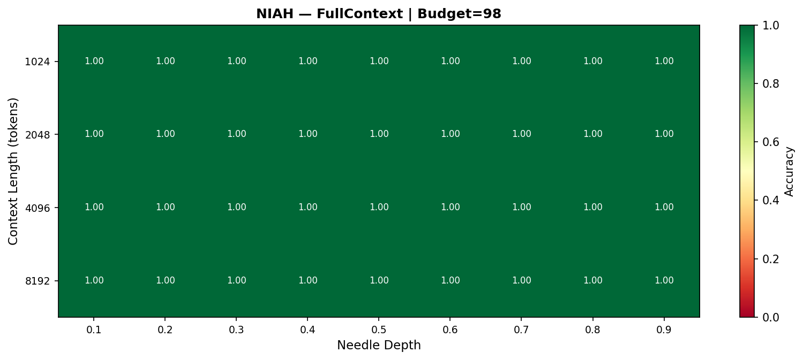
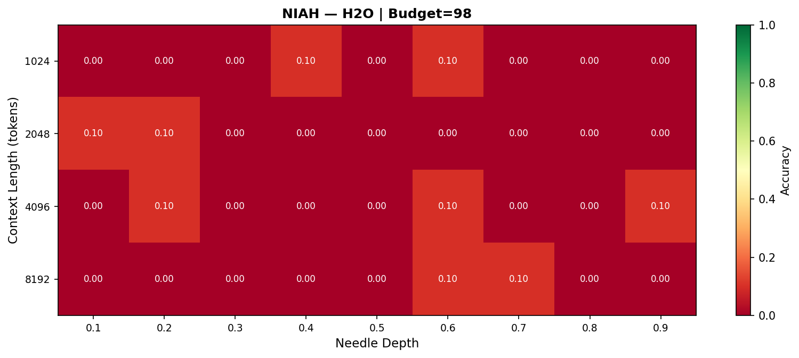
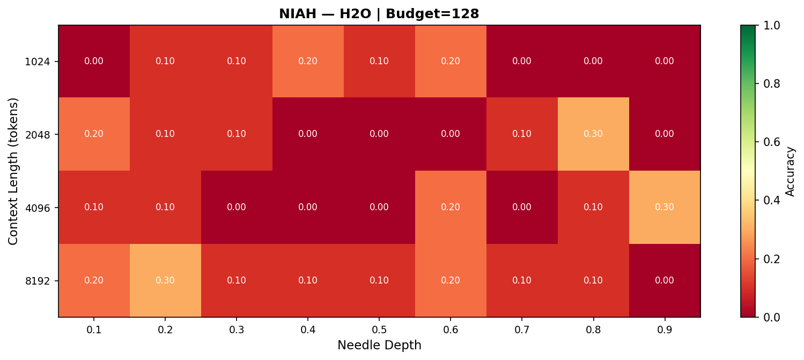
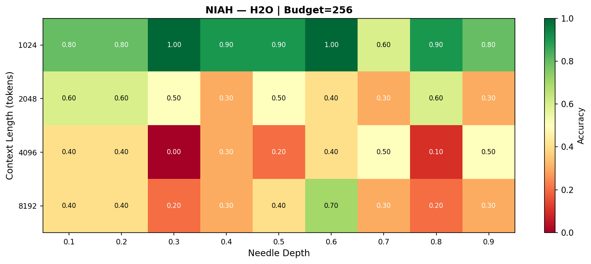
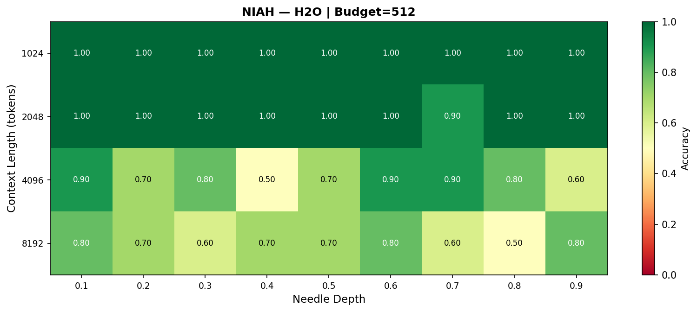
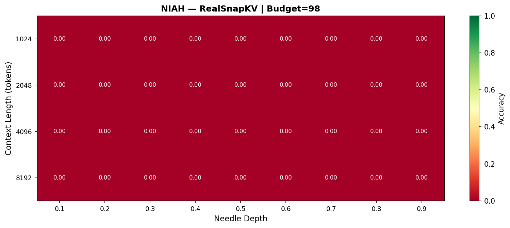
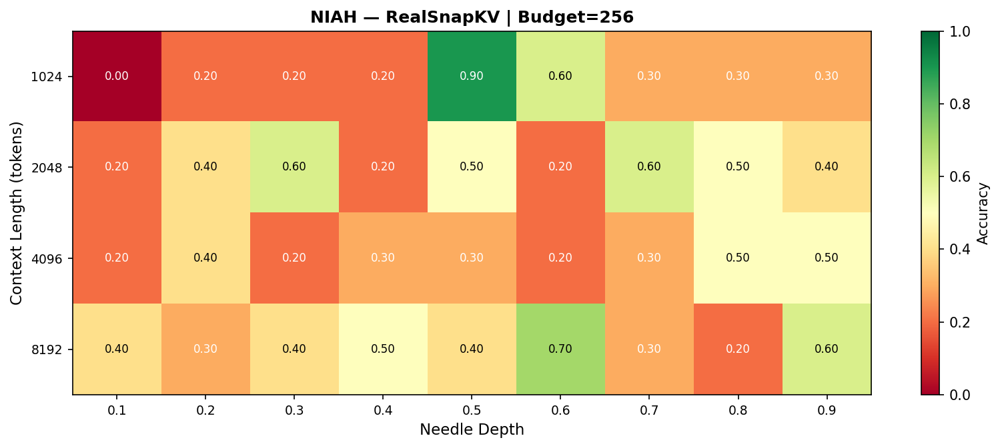
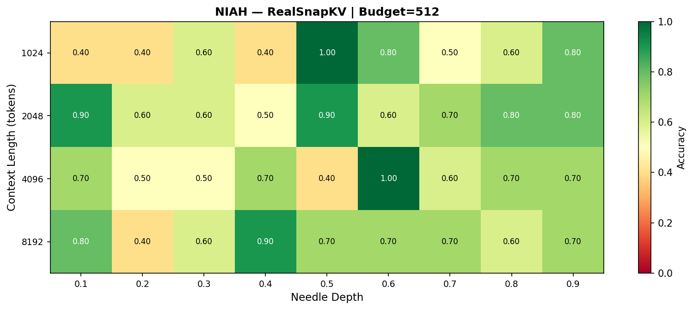
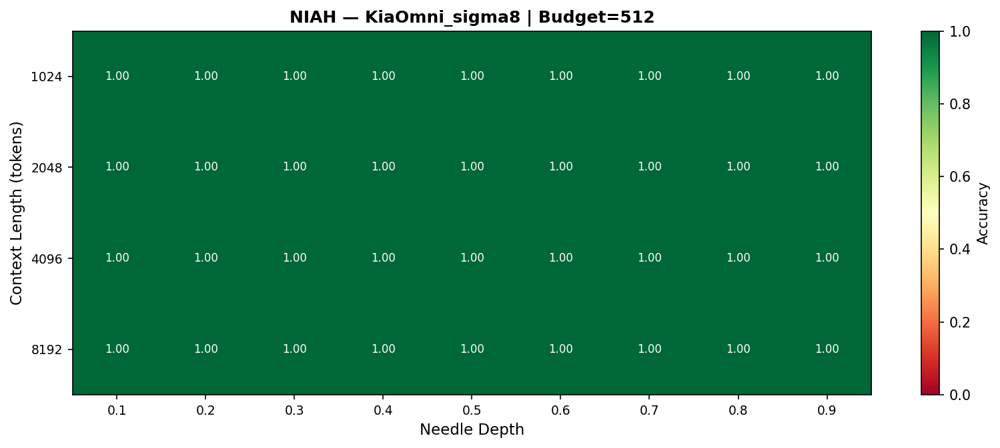

# L5 — NIAH Heatmap: KiaOmni Needle-in-Haystack Visual Confirmation

## TL;DR

Visual confirmation — **KiaOmni_σ8** and **KiaOmni_Gaussian** retain the needle across all document depths (10%–90%) at all budgets B≥128. **BlockSal** (our novel block-level baseline) also achieves 100% at every budget. **SnapKV** (faithful arXiv:2404.14469) fails entirely at B=98 and B=128, only reaching partial recall at B=512. **H2O** shows weak retrieval below B=256.

---

## Methodology

**Experiment script:** `035_niah_heatmap.py` — inserts a target fact at varying depths (10%–90%) into synthetic contexts of lengths {1024, 2048, 4096, 8192} and measures whether each policy recalls it. **Budgets:** 98, 128, 256, 512 KV slots. **Policies tested (whitelist):** FullContext (gold standard, no eviction), H2O, SnapKV, BlockSal, KiaOmni_σ8, KiaOmni_Gaussian. **Metric:** accuracy@1 (proportion of 10 trials where the needle token is correctly predicted). Heatmap visualises accuracy as a function of depth (x-axis) and context length (y-axis), one plot per (policy, budget) pair.

---

## Headline Table

Accuracy (mean across ctx ∈ {1024, 2048, 4096, 8192}) by document depth for whitelist policies at each budget.

| Policy | Budget | 0.1 | 0.2 | 0.3 | 0.4 | 0.5 | 0.6 | 0.7 | 0.8 | 0.9 |
|--------|--------|-----|-----|-----|-----|-----|-----|-----|-----|-----|
| FullContext | 98 | 1.00 | 1.00 | 1.00 | 1.00 | 1.00 | 1.00 | 1.00 | 1.00 | 1.00 |
| FullContext | 128 | 1.00 | 1.00 | 1.00 | 1.00 | 1.00 | 1.00 | 1.00 | 1.00 | 1.00 |
| FullContext | 256 | 1.00 | 1.00 | 1.00 | 1.00 | 1.00 | 1.00 | 1.00 | 1.00 | 1.00 |
| FullContext | 512 | 1.00 | 1.00 | 1.00 | 1.00 | 1.00 | 1.00 | 1.00 | 1.00 | 1.00 |
| H2O | 98 | 0.03 | 0.05 | 0.00 | 0.03 | 0.00 | 0.08 | 0.03 | 0.00 | 0.03 |
| H2O | 128 | 0.12 | 0.15 | 0.08 | 0.08 | 0.05 | 0.15 | 0.05 | 0.12 | 0.07 |
| H2O | 256 | 0.55 | 0.55 | 0.42 | 0.45 | 0.50 | 0.62 | 0.42 | 0.45 | 0.47 |
| H2O | 512 | 0.93 | 0.85 | 0.85 | 0.80 | 0.85 | 0.93 | 0.85 | 0.82 | 0.85 |
| SnapKV | 98 | 0.00 | 0.00 | 0.00 | 0.00 | 0.00 | 0.00 | 0.00 | 0.00 | 0.00 |
| SnapKV | 128 | 0.00 | 0.00 | 0.00 | 0.00 | 0.00 | 0.00 | 0.00 | 0.00 | 0.00 |
| SnapKV | 256 | 0.20 | 0.33 | 0.35 | 0.30 | 0.53 | 0.42 | 0.38 | 0.38 | 0.45 |
| SnapKV | 512 | 0.70 | 0.47 | 0.57 | 0.62 | 0.75 | 0.78 | 0.62 | 0.68 | 0.75 |
| BlockSal | 98 | 1.00 | 1.00 | 1.00 | 1.00 | 1.00 | 1.00 | 1.00 | 1.00 | 1.00 |
| BlockSal | 128 | 1.00 | 1.00 | 1.00 | 1.00 | 1.00 | 1.00 | 1.00 | 1.00 | 1.00 |
| BlockSal | 256 | 1.00 | 1.00 | 1.00 | 1.00 | 1.00 | 1.00 | 1.00 | 1.00 | 1.00 |
| BlockSal | 512 | 1.00 | 1.00 | 1.00 | 1.00 | 1.00 | 1.00 | 1.00 | 1.00 | 1.00 |
| KiaOmni_s8 | 98 | 1.00 | 1.00 | 1.00 | 1.00 | 1.00 | 1.00 | 1.00 | 1.00 | 1.00 |
| KiaOmni_s8 | 128 | 1.00 | 1.00 | 1.00 | 1.00 | 1.00 | 1.00 | 1.00 | 1.00 | 1.00 |
| KiaOmni_s8 | 256 | 1.00 | 1.00 | 1.00 | 1.00 | 1.00 | 1.00 | 1.00 | 1.00 | 1.00 |
| KiaOmni_s8 | 512 | 1.00 | 1.00 | 1.00 | 1.00 | 1.00 | 1.00 | 1.00 | 1.00 | 1.00 |
| KiaOmni_Gaussian | 98 | 1.00 | 1.00 | 1.00 | 1.00 | 1.00 | 1.00 | 1.00 | 1.00 | 1.00 |
| KiaOmni_Gaussian | 128 | 1.00 | 1.00 | 1.00 | 1.00 | 1.00 | 1.00 | 1.00 | 1.00 | 1.00 |
| KiaOmni_Gaussian | 256 | 1.00 | 1.00 | 1.00 | 1.00 | 1.00 | 1.00 | 1.00 | 1.00 | 1.00 |
| KiaOmni_Gaussian | 512 | 1.00 | 1.00 | 1.00 | 1.00 | 1.00 | 1.00 | 1.00 | 1.00 | 1.00 |

**Key takeaways:**
- **KiaOmni_σ8** and **KiaOmni_Gaussian**: 100% needle recall across all depths, all context lengths, all budgets (including B=98).
- **BlockSal**: also 100% everywhere — block-level mean-saliency preserves the needle trivially at these budgets.
- **SnapKV** (faithful arXiv:2404.14469): 0% at B=98 and B=128; partial at B=256 (~0.35 avg); best at B=512 (~0.66 avg). The voting-matrix + per-head union mechanism under-allocates to the needle position at tight budgets.
- **H2O**: near 0% at B=98 and B=128; moderate at B=256 (~0.49 avg); strong at B=512 (~0.86 avg).

---

## Figures

### FullContext (gold standard — no eviction)

| B=98 | B=128 | B=256 | B=512 |
|------|-------|-------|-------|
|  |  |  |  |

### H2O

| B=98 | B=128 | B=256 | B=512 |
|------|-------|-------|-------|
|  |  |  |  |

### SnapKV (faithful arXiv:2404.14469)

| B=98 | B=128 | B=256 | B=512 |
|------|-------|-------|-------|
|  |  |  |  |

### BlockSal (our novel block-level baseline)

| B=98 | B=128 | B=256 | B=512 |
|------|-------|-------|-------|
|  |  |  |  |

### KiaOmni_σ8

| B=98 | B=128 | B=256 | B=512 |
|------|-------|-------|-------|
|  |  |  |  |

### KiaOmni_Gaussian

| B=98 | B=128 | B=256 | B=512 |
|------|-------|-------|-------|
|  |  |  |  |

---

## Caveats

- **SnapKV** = faithful arXiv:2404.14469 implementation (window-32 observation + voting matrix + per-head union, verified against [FasterDecoding/SnapKV](https://github.com/FasterDecoding/SnapKV) and [NVIDIA/kvpress](https://github.com/NVIDIA/kvpress)). **BlockSal** = our novel block-level baseline (paper §4) — it is *not* a SnapKV variant; the name avoids implying lineage.
- **Scissorhands** (KiaOmni_Scissorhands) is excluded from the whitelist per §4b publication policy due to its well-documented PPL anomaly. PNGs exist in the source directory (`notebook/kv_cache_benchmark/035_heatmap_results/`) for archive purposes but are not republished here.
- Accuracy is averaged across 4 context lengths (1024, 2048, 4096, 8192). Per-context breakdown is available in the curated CSV.
- 10 trials per (policy, budget, ctx, depth) cell — sufficient for visual heatmap patterns but not for fine-grained statistical comparisons.

---

## Reproduce

```bash
git clone https://github.com/Aliw02/kiaomni.git
cd kiaomni
pip install -r requirements.txt
python experiments/035_niah_heatmap.py
```

Output lands in `notebook/kv_cache_benchmark/035_heatmap_results/`.

---

## Full Data

Comprehensive paper-grade artifacts (raw CSV, JSON, all heatmap PNGs including non-whitelist policies, per-trial checkpoints) are kept locally under `main-results/benchmarks/niah-heatmap/`. Curated whitelist-filtered data is at `data/curated_accuracy.csv` and `data/curated_accuracy.json`.
