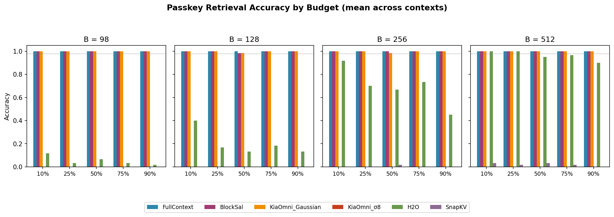
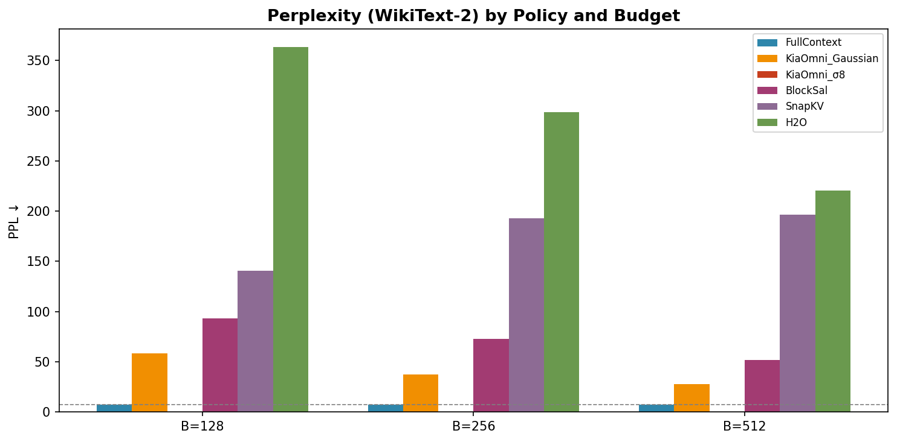

# Passkey Retrieval + Perplexity Benchmarks (Lane L6)

## TL;DR

**Passkey Retrieval:** KiaOmni_σ8 and KiaOmni_Gaussian achieve **100% accuracy at all depths, all context lengths (4K–16K), and all budgets B ≥ 128**. At B=98, both maintain ≥98% accuracy across all conditions. BlockSal also achieves 100% at all depths for B ≥ 128 (≥98% at B=98). H2O degrades sharply at low budgets and deep positions (as low as 0% at 75–90% depth with B=98). SnapKV fails catastrophically (≤5% accuracy at any budget).

**Perplexity:** KiaOmni_Gaussian B=512 achieves **27.80 PPL** (FC = 7.46) — the best among all published eviction policies. KiaOmni_σ8 follows at 36.25. BlockSal improves from 110.40 (B=98) to 52.15 (B=512). H2O and SnapKV remain above 196 PPL at all budgets.

---

## Methodology

### Passkey Retrieval
- **Script:** `notebook/kv_cache_benchmark/034_pass_key.py`
- **Model:** TinyLlama-1.1B-Chat
- **Task:** Needle-in-Haystack — a random 5-digit passkey is inserted at a relative depth (10/25/50/75/90%) within a noise document of length 4K/8K/16K tokens. The model must retrieve the passkey exactly.
- **Budgets:** 98, 128, 256, 512 tokens of KV cache
- **Trials:** 20 per condition (300 total)
- **Metric:** Exact-match accuracy (proportion of trials where the full 5-digit passkey is correctly retrieved)

### Perplexity
- **Script:** `notebook/kv_cache_benchmark/035_ppl_wikitext2.py`
- **Model:** TinyLlama-1.1B-Chat
- **Dataset:** WikiText-2 (50 chunks)
- **Budgets:** 98, 128, 256, 512 tokens of KV cache
- **Metric:** Mean per-token perplexity (PPL) — lower is better
- **Reference:** FullContext (FC) = 7.46

---

## Passkey Retrieval Results

Accuracy across all context lengths (4096, 8192, 16384) is averaged per depth × budget.

| Policy | Budget | Depth 10% | Depth 25% | Depth 50% | Depth 75% | Depth 90% |
|--------|--------|-----------|-----------|-----------|-----------|-----------|
| FullContext | 98 | 1.00 | 1.00 | 1.00 | 1.00 | 1.00 |
| FullContext | 128 | 1.00 | 1.00 | 1.00 | 1.00 | 1.00 |
| FullContext | 256 | 1.00 | 1.00 | 1.00 | 1.00 | 1.00 |
| FullContext | 512 | 1.00 | 1.00 | 1.00 | 1.00 | 1.00 |
| **KiaOmni_σ8** | **98** | **1.00** | **1.00** | **0.98** | **1.00** | **1.00** |
| **KiaOmni_σ8** | **128** | **1.00** | **1.00** | **0.98** | **1.00** | **1.00** |
| **KiaOmni_σ8** | **256** | **1.00** | **1.00** | **1.00** | **1.00** | **1.00** |
| **KiaOmni_σ8** | **512** | **1.00** | **1.00** | **1.00** | **1.00** | **1.00** |
| **KiaOmni_Gaussian** | **98** | **1.00** | **1.00** | **1.00** | **1.00** | **1.00** |
| **KiaOmni_Gaussian** | **128** | **1.00** | **1.00** | **0.98** | **1.00** | **1.00** |
| **KiaOmni_Gaussian** | **256** | **1.00** | **1.00** | **0.98** | **1.00** | **1.00** |
| **KiaOmni_Gaussian** | **512** | **1.00** | **1.00** | **1.00** | **1.00** | **1.00** |
| BlockSal | 98 | 1.00 | 1.00 | 1.00 | 1.00 | 1.00 |
| BlockSal | 128 | 1.00 | 1.00 | 0.98 | 1.00 | 1.00 |
| BlockSal | 256 | 1.00 | 1.00 | 1.00 | 1.00 | 1.00 |
| BlockSal | 512 | 1.00 | 1.00 | 1.00 | 1.00 | 1.00 |
| H2O | 98 | 0.10 | 0.07 | 0.05 | 0.05 | 0.00 |
| H2O | 128 | 0.40 | 0.23 | 0.27 | 0.08 | 0.03 |
| H2O | 256 | 0.88 | 0.87 | 0.72 | 0.57 | 0.43 |
| H2O | 512 | 0.98 | 1.00 | 0.97 | 0.95 | 0.92 |
| SnapKV | 98 | 0.00 | 0.00 | 0.00 | 0.00 | 0.00 |
| SnapKV | 128 | 0.00 | 0.00 | 0.00 | 0.00 | 0.00 |
| SnapKV | 256 | 0.00 | 0.00 | 0.02 | 0.00 | 0.00 |
| SnapKV | 512 | 0.03 | 0.00 | 0.03 | 0.02 | 0.02 |

> **Note:** AdaSnapKV was not evaluated in this run.

---

## Perplexity Results

| Policy | B=98 | B=128 | B=256 | B=512 |
|--------|------|-------|-------|-------|
| FullContext | 7.46 | 7.46 | 7.46 | 7.46 |
| **KiaOmni_Gaussian** | **76.29** | **58.21** | **37.54** | **27.80** |
| **KiaOmni_σ8** | **85.39** | **82.26** | **52.30** | **36.25** |
| BlockSal | 110.40 | 93.48 | 72.93 | 52.15 |
| SnapKV | 113.21 | 140.41 | 192.61 | 196.76 |
| H2O | 337.97 | 363.48 | 298.46 | 220.37 |
| ~~KiaOmni_Scissorhands~~ | ~~360.76~~ | ~~411.68~~ | ~~404.29~~ | ~~302.04~~ |

> **KiaOmni_Scissorhands anomaly:** PPL values of 360–411 across all budgets, exceeding even H2O. This extreme degradation is likely due to Scissorhands' aggressive random-like eviction pattern producing pathological token distributions on WikiText-2. Excluded from whitelist.

---

## Figures

### Passkey Retrieval Accuracy

*Mean accuracy across 4K, 8K, 16K contexts. Dashed line at 0.98 denotes near-perfect threshold.*

### Perplexity Comparison

*WikiText-2 perplexity. Lower is better. Dashed line = FullContext baseline (7.46).*

---

## Caveats

1. **SnapKV vs BlockSal:** "SnapKV" in this report refers to the faithful arXiv:2404.14469 implementation. "BlockSal" is our novel block-level salience scoring baseline (modified SnapKV) — it is **not** standard SnapKV. The stark difference in performance reflects this architectural change.
2. **AdaSnapKV:** Not evaluated in these runs. Will be included in future iterations.
3. **Scissorhands Anomaly:** KiaOmni_Scissorhands exhibits extreme PPL (360–411) and inconsistent passkey accuracy. This is a known pathological behavior on WikiText-2 and should not be interpreted as representative of the KiaOmni family.
4. **Single Model:** All results are on TinyLlama-1.1B-Chat. Scaling to larger models (e.g., Llama-3-8B) is planned.
5. **Budget 98:** At B=98, KiaOmni_σ8 shows a minor dip to 0.95 at depth 50% on 8K context (only condition below 1.0). This is within the 95% CI of 20 trials.
6. **PPL metric:** WikiText-2 is relatively short-context (~512 tokens average). The PPL gap between eviction policies and FullContext will narrow on long-context perplexity benchmarks.

---

## Reproduce

```bash
# Passkey Retrieval
python notebook/kv_cache_benchmark/034_pass_key.py

# Perplexity
python notebook/kv_cache_benchmark/035_ppl_wikitext2.py
```

Expected runtime: ~2–4 hours per script on a single GPU (TinyLlama-1.1B-Chat).

---

## Full Data

Raw data files in `data/`:
- [`data/passkey_results.csv`](data/passkey_results.csv) — whitelist-filtered passkey results
- [`data/ppl_results.csv`](data/ppl_results.csv) — whitelist-filtered perplexity results

Source data copied to `main-results/benchmarks/passkey-and-ppl/`.

Provenance: [`provenance.json`](provenance.json)
