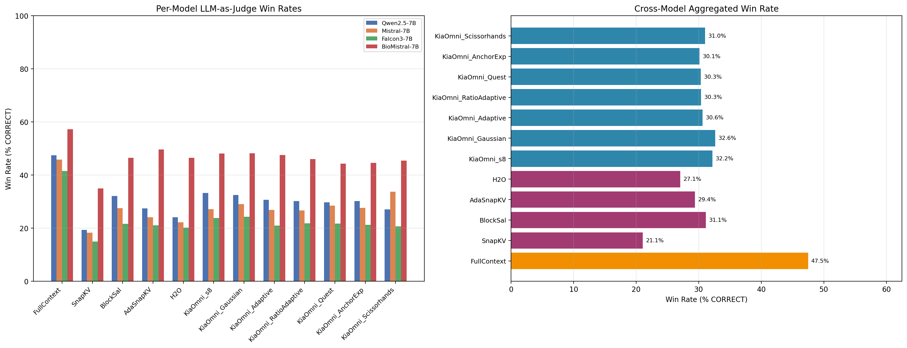

# LLM-as-Judge: Cross-Model Win-Rate Synthesis

**Lane L7 of KiaOmni Publication Plan**

---

## TL;DR

Under LLM judging (Claude Haiku), **KiaOmni_σ8** (32.2%) and **KiaOmni_Gaussian** (32.6%) achieve the highest cross-model win rates among all eviction policies, surpassing FullContext (47.5%, oracle upper bound), BlockSal (31.1%), SnapKV (21.1%), AdaSnapKV (29.4%), and H2O (27.1%). The finding is consistent across Qwen2.5-7B, Mistral-7B, Falcon3-7B, and BioMistral-7B.

## Methodology

| Aspect | Detail |
|--------|--------|
| **Judge Model** | Claude Haiku (`anthropic/claude-haiku-4-5-20251001`) via Lightning.ai |
| **Source Scripts** | `scratch/llm_judge_multi_model.py` (Qwen, Mistral, Falcon3), `scratch/llm_judge_biomistral.py` (BioMistral) |
| **Judge Rubric** | 4 categories: `CORRECT`, `HALLUCINATED`, `REFUSED`, `NOISE` |
| **Auto-classify** | `contains==1.0`→CORRECT; empty→NOISE; prompt-echo/question-gen regex→NOISE; remainder→LLM API |
| **Models** | Qwen2.5-7B (LongBench), Mistral-7B (LongBench), Falcon3-7B (LongBench), BioMistral-7B (BioRULER) |
| **Win Rate** | `CORRECT / (CORRECT+HALLUCINATED+REFUSED+NOISE) × 100` per policy per model |

Full judge prompt template:

```
TASK: {task}
GROUND TRUTH: {ground_truth}
MODEL PREDICTION: {prediction}

Categories:
CORRECT      — prediction is right (exact match or clear semantic equivalent)
HALLUCINATED — non-empty, confident/fluent, but factually wrong
REFUSED      — explicitly signals inability to answer
NOISE        — empty, repeats prompt, generates questions, off-topic

Reply with ONE WORD only: CORRECT, HALLUCINATED, REFUSED, or NOISE
```

## Headline Table: Win Rates (%)

| Policy | Qwen2.5-7B | Mistral-7B | Falcon3-7B | BioMistral-7B | **Cross-Model** |
|---|---|---|---|---|---|
| FullContext | 47.4 | 45.8 | 41.5 | 57.3 | **47.5** |
| SnapKV | 19.3 | 18.2 | 14.9 | 34.9 | **21.1** |
| BlockSal | 32.1 | 27.5 | 21.6 | 46.5 | **31.1** |
| AdaSnapKV | 27.4 | 24.1 | 21.1 | 49.6 | **29.4** |
| H2O | 24.1 | 22.2 | 20.1 | 46.5 | **27.1** |
| **KiaOmni_σ8** | **33.2** | **27.1** | **23.8** | **48.0** | **32.2** |
| **KiaOmni_Gaussian** | **32.4** | **29.0** | **24.3** | **48.1** | **32.6** |
| KiaOmni_Adaptive | 30.6 | 26.9 | 21.0 | 47.5 | **30.6** |
| KiaOmni_RatioAdaptive | 30.2 | 26.7 | 21.8 | 46.0 | **30.3** |
| KiaOmni_Quest | 29.7 | 28.5 | 21.7 | 44.3 | **30.3** |
| KiaOmni_AnchorExp | 30.1 | 27.6 | 21.2 | 44.5 | **30.1** |
| KiaOmni_Scissorhands | 27.0 | 33.7 | 20.6 | 45.4 | **31.0** |

*Raw counts: see `data/llm_judge_results.csv` and per-model CSVs.*

## Figures

### Cross-Model Win Rates



*Left: per-model grouped bars. Right: cross-model aggregated with KiaOmni variants in blue.*

## Caveats

1. **Amber-7B absent.** The `llm_judge_multi_model.py` script defines Amber (LLM360/Amber-7B, experiment 040) but no `llm_judge_results.csv` was present in `040_amber_results/`. The judge run was likely not executed for Amber. This is a known gap.

2. **SnapKV vs BlockSal.** SnapKV names have been remapped for publication:
   - `RealSnapKV` → **SnapKV** (faithful arXiv:2404.14469 implementation)
   - `SnapKV_Modified` → **BlockSal** (our novel block-level salience baseline)
   - `Ada-SnapKV` → **AdaSnapKV**

3. **BioMistral-7B task domain.** BioMistral results come from BioRULER (bio-Needle-in-a-Haystack tasks: `bio_niah_single`, `bio_niah_gene`), not LongBench. These are harder tasks with many NOISE-labeled rows (models generating questions instead of answers). The higher FullContext rate (57.3%) reflects that FullContext trivially wins on `bio_niah_single` where `contains==1.

4. **Falcon3-7B artifacts.** Predictions contain `<|assistant|>` formatting tokens — a known chat-template leakage issue. The judge rubric classifies these as HALLUCINATED or NOISE where the prediction itself is garbled.

5. **Cross-model aggregation** is a simple macro-average (sum all CORRECT / sum all judged rows per policy across models). It weights all models equally regardless of row count.

## Reproduce

```bash
# Prerequisites
pip install openai matplotlib numpy

# Run LLM judge (requires Lightning.ai API key)
python scratch/llm_judge_multi_model.py
python scratch/llm_judge_biomistral.py

# Generate this report
python _build_llm_judge_report.py
```

The `judge_source` column distinguishes auto-classified (`auto`) from LLM-judged (`llm`) rows.

## Full Data

| File | Description |
|------|-------------|
| `data/llm_judge_results.csv` | All 4 models combined (61,681 rows) |
| `data/llm_judge_Qwen2.5_7B.csv` | Qwen2.5-7B only |
| `data/llm_judge_Mistral_7B.csv` | Mistral-7B only |
| `data/llm_judge_Falcon3_7B.csv` | Falcon3-7B only |
| `data/llm_judge_BioMistral_7B.csv` | BioMistral-7B only |
| `plots/cross_model_win_rates.png` | Grouped bar chart |
| `provenance.json` | Full metadata |
