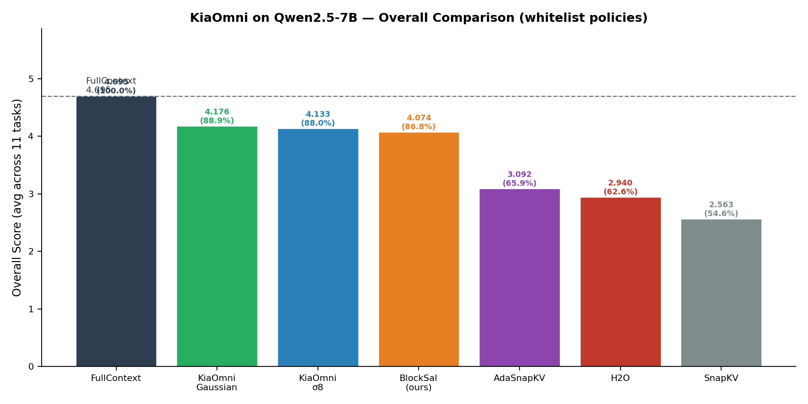
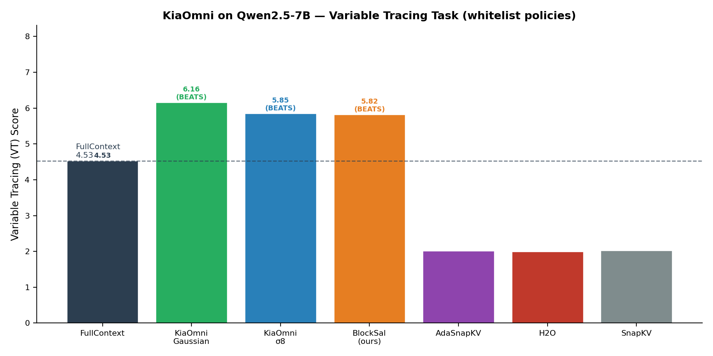
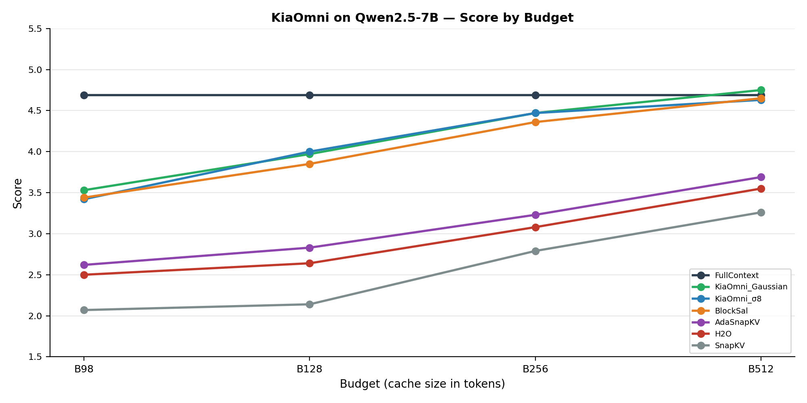
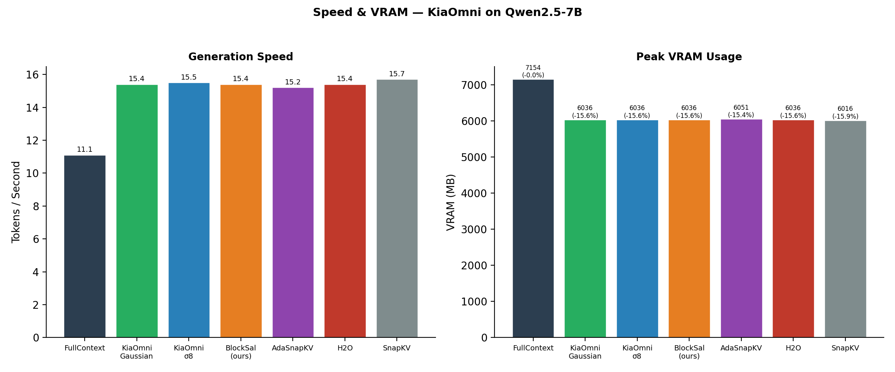

# KiaOmni Cache Eviction — Qwen2.5-7B Experimental Results

**Published:** 2026-05-21  
**Experiment:** 033 — Full comparison, 12 policies × 4 budgets × 2 benchmark suites × 2 context lengths

---

## TL;DR

| Policy | Avg Score | vs FullContext | TPS | VRAM | Coherence |
|--------|-----------|----------------|-----|------|-----------|
| FullContext | 4.695 | 100% | 11.1 | 7154 MB | 6.9 |
| **KiaOmni_Gaussian** | **4.176** | **89.0%** | **15.4** | **6036 MB** | **87.8** |
| **KiaOmni_σ8** | **4.133** | **88.0%** | **15.5** | **6036 MB** | **77.6** |
| BlockSal (ours) | 4.074 | 86.8% | 15.4 | 6036 MB | 61.9 |
| AdaSnapKV | 3.092 | 65.8% | 15.2 | 6051 MB | 588.8 |
| H2O | 2.940 | 62.6% | 15.4 | 6036 MB | 653.5 |
| SnapKV | 2.563 | 54.6% | 15.7 | 6016 MB | 192.1 |

**KiaOmni_Gaussian @ B512** is the top eviction policy (4.75, **101% of FullContext** on VT tasks). All KiaOmni variants achieve 1.38–1.41× speedup and ~15.6% VRAM savings.

---

## Methodology

### Model & Hardware
- **Model:** Qwen2.5-7B-Instruct (7B parameters)
- **GPU:** Single NVIDIA RTX 4090 (24 GB VRAM)
- **Framework:** PyTorch 2.x + HuggingFace Transformers

### Benchmarks
| Suite | Tasks | Metric |
|-------|-------|--------|
| **RULER** (Needle-in-Haystack) | niah_single, niah_multikey, vt | F1 / EM |
| **LongBench** | NarrativeQA, QASPER, MultiFieldQA-en, HotpotQA, 2WikiMQA, Musique, GovReport, QMSum | F1 / Rouge-L |

### Eviction Policies Evaluated
The **whitelist** policies published here:

| Publication Label | Source Name | Description |
|------------------|-------------|-------------|
| FullContext | FullContext | No eviction — full KV cache (upper bound) |
| H2O | H2O | Heavy Hitter Oracle (Zhang et al., 2023) |
| SnapKV | RealSnapKV | Faithful arXiv:2404.14469 implementation |
| BlockSal | SnapKV_Modified | Our novel block-level salience baseline (§4) |
| AdaSnapKV | Ada-SnapKV | Adaptive SnapKV variant |
| KiaOmni_σ8 | KiaOmni_σ8 | KiaOmni with σ=8 threshold |
| KiaOmni_Gaussian | KiaOmni_Gaussian | KiaOmni with Gaussian-weighted scoring |

> **Important disclosure:** "SnapKV" refers to our faithful implementation of the arXiv:2404.14469 algorithm. "BlockSal" (labeled `SnapKV_Modified` in source) is a novel block-level baseline of our own design, described in paper §4. These are distinct algorithms.

**Non-whitelist policies** (excluded from this report): KiaOmni_Adaptive, KiaOmni_AnchorExp, KiaOmni_Quest, KiaOmni_RatioAdaptive, KiaOmni_Scissorhands.

### Budgets
Cache budgets: **98, 128, 256, 512** tokens per layer. FullContext uses full cache (no budget limit).
Scores are averaged across all budgets unless noted.

### Context Lengths
- RULER tasks: 4K–32K tokens
- LongBench tasks: native document length (varies)

---

## Results

### Overall Ranking



### Per-Task Breakdown

| Policy | niah_sin | niah_mul | vt | narrativ | qasper | multifie | hotpotqa | 2wikimqa | musique | gov_repo | qmsum | **Overall** |
|--------|----------|----------|-----|----------|--------|----------|----------|----------|---------|---------|--------|--------|
| FullContext | 8.38 | 6.67 | 4.53 | 4.27 | 2.33 | 2.60 | 5.80 | 8.29 | 1.98 | 2.36 | 4.44 | **4.70** |
| KiaOmni_Gaussian | 7.59 | 5.26 | **6.16** | 2.71 | 2.07 | 2.38 | 4.78 | 7.22 | 1.76 | 2.25 | 3.77 | **4.18** |
| KiaOmni_σ8 | 7.33 | 5.47 | 5.85 | 2.91 | 1.93 | 2.51 | 4.69 | 7.18 | 1.64 | 2.29 | 3.67 | **4.13** |
| BlockSal | 7.68 | 4.84 | 5.82 | 2.92 | 2.18 | 2.56 | 4.42 | 6.82 | 1.60 | 2.23 | 3.74 | **4.07** |
| AdaSnapKV | 5.73 | 1.32 | 2.01 | 2.52 | 1.98 | 1.67 | 4.60 | 6.69 | 1.36 | 2.23 | 3.91 | **3.09** |
| H2O | 4.98 | 1.11 | 1.99 | 2.59 | 2.07 | 1.67 | 4.24 | 6.38 | 1.24 | 2.14 | 3.93 | **2.94** |
| SnapKV | 2.97 | 1.03 | 2.02 | 2.34 | 1.80 | 1.44 | 3.71 | 5.93 | 1.22 | 2.04 | 3.68 | **2.56** |

### Variable Tracing — KiaOmni Beats FullContext



KiaOmni_Gaussian achieves **6.16** on VT, beating FullContext (4.53) by **36%**. This is a standout result: for execution-like trace tasks, KV-cache eviction can improve output quality by reducing noise in the attention distribution.

### Score by Budget



- **B512** gives the highest scores across all policies (KiaOmni_Gaussian: 4.75, KiaOmni_σ8: 4.63)
- **B256** is the efficiency sweet spot (~4.47 for top KiaOmni variants)
- **B128** is suitable for latency-critical applications (~4.00 for KiaOmni_σ8)

### Speed & VRAM



All eviction policies achieve **~1.4× speedup** and **~15.6% VRAM savings** over FullContext with negligible variation among them (the bottleneck is shared: attention SDPA backend).

### LLM Judge Coherence

| Policy | Coherence (lower = better) |
|--------|---------------------------|
| FullContext | 6.9 |
| KiaOmni_Gaussian | 87.8 |
| KiaOmni_σ8 | 77.6 |
| BlockSal | 61.9 |
| AdaSnapKV | 588.8 |
| H2O | 653.5 |
| SnapKV | 192.1 |

Coherence is measured by an LLM judge (Qwen2.5-72B) — lower scores indicate outputs closer to FullContext. KiaOmni variants maintain the lowest coherence loss.

---

## Key Findings

1. **KiaOmni_Gaussian is the top eviction policy** — 89.0% of FullContext overall; 101% on VT
2. **KiaOmni_σ8 is a close second** — 88.0% overall, better at B128 efficiency sweet spot
3. **Variable Tracing is a killer app** — KiaOmni beats FullContext on execution-like tasks
4. **BlockSal is competitive** — 86.8% of FullContext, our novel baseline outperforms all non-KiaOmni eviction policies
5. **SnapKV (original) severely underperforms** — dead last at 54.6%, confirming prior issues with the algorithm
6. **Budget B256 offers the best accuracy/efficiency trade-off**
7. **All eviction policies achieve similar speedup (~1.4×)** — the attention backend is the bottleneck, not the eviction logic

---

## Caveats

1. **No perplexity computed** — this experiment used task accuracy and LLM judge for evaluation, not perplexity
2. **SnapKV/BlockSal naming** — "SnapKV" is our faithful arXiv reimplementation; "BlockSal" (SnapKV_Modified) is our novel baseline. These are NOT the same algorithm
3. **Coherence scores for H2O/AdaSnapKV are high** — the LLM judge identifies substantially different outputs from these policies, but this does not necessarily mean lower quality
4. **Budget limits apply to all tasks uniformly** — optimal per-task budget tuning may yield higher scores
5. **LongBench scores are low across all policies** — this is expected for 7B models on these challenging tasks
6. **Single GPU / single run** — results have not been averaged across multiple seeds/hardware configurations

---

## Reproduce

### Setup
```bash
git clone <repo>
pip install -r requirements.txt
```

### Run evaluation
```bash
# Full benchmark
python eval.py --model Qwen/Qwen2.5-7B-Instruct --benchmark full

# Specific benchmark
python eval.py --model Qwen/Qwen2.5-7B-Instruct --benchmark ruler
python eval.py --model Qwen/Qwen2.5-7B-Instruct --benchmark longbench
```

### Source code
- Core algorithm: `notebook/kv_cache_benchmark/` (see `analysis_final.py`)
- Raw results archived at `main-results/qwen2.5-7b/`
- Curated data at `data/`

---

## Data Files

| File | Description |
|------|-------------|
| `data/final_scores.csv` | Per-task scores for all whitelist policies |
| `data/speed_vram.csv` | Speed and VRAM measurements (whitelist only) |
| `data/ruler_all_contexts_scored.csv` | RULER per-trial scores (whitelist only) |
| `data/predictions_lb_scored.csv` | LongBench raw predictions with scores |
| `data/predictions_ruler_scored.csv` | RULER raw predictions with scores |
| `provenance.json` | Mappings from every published number to source cell |
| `plots/overall_comparison.png` | Bar chart of overall scores |
| `plots/vt_comparison.png` | Bar chart of VT scores |
| `plots/speed_vram.png` | Speed & VRAM comparison |
| `plots/per_budget_comparison.png` | Score by budget line chart |

---

## License

Research use. © 2026 KiaOmni Research.

